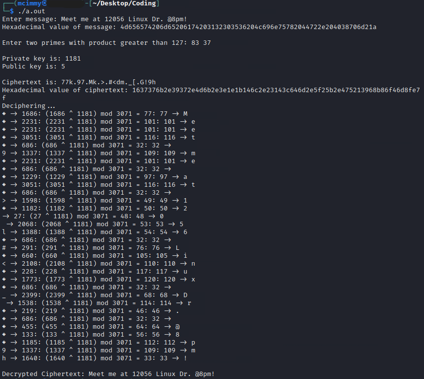
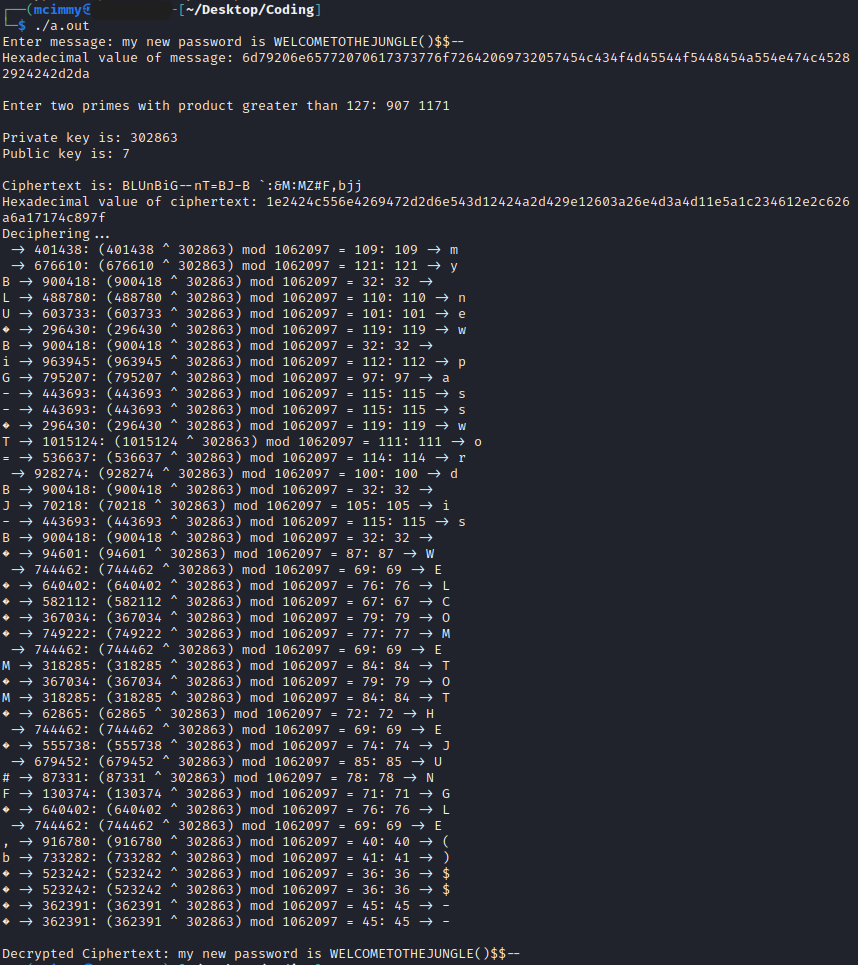

# RSA-Example

Implementation of RSA in C where the parameter generation and enc/decryption process of the cryptosystem can be visualized via standard output and ASCII values are used for numerical computation. 

**Note:** The first 32 characters of the ASCII table can not be displayed by the terminal (they're control characters) and hence the omission of some of the characters next to the ASCII values (mod 128) in the deciphering part and the diamond shaped symbol

